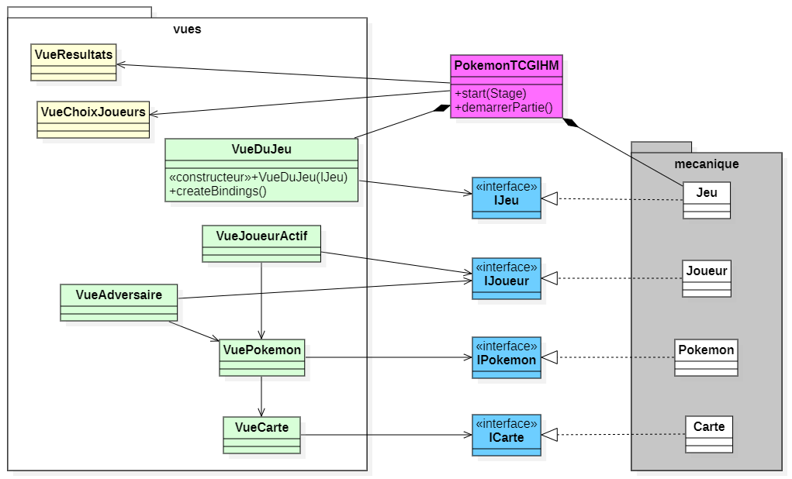

# TP Démarrage du projet IHM - _Pokemon TCG_

Ce TP est prévu pour vous aider à comprendre comment interagir avec la mécanique interne du jeu. **Attention, ce n'est pas le dépôt correspondant à votre projet**, mais un dépôt correspondant à un travail préparatoire. Chaque membre de l'équipe de projet travaille dans son propre dépôt, afin de se familiariser **individuellement** avec l'environnement. La durée estimative du TP est de **2h-2h30**.

Vous exploiterez ensuite le travail que vous avez fait pendant ce TP, pour l'intégrer (éventuellement en copiant-collant) dans les fichiers de votre projet. Le code de la mécanique de ce TP est totalement identique à celui que vous avez dans le dépôt de votre projet IHM.

Pour vous aider, pensez à consulter le diagramme de classes :

## Étapes (à faire individuellement)
1. On travaille pour l'instant avec la classe `VueDuJeu`. Transformez la vue du jeu en `VBox`. 
Ajoutez-y un label `instruction`, et faites en sorte que le texte de ce label corresponde (binding !) à l'instruction donnée par le jeu.
Changez aussi le style du texte de ce label pour choisir une fonte de caractères plus grande (18 px par exemple), et pour la suite du TP, vous appliquerez systématiquement ce style au texte des futurs composants graphiques.

   **Remarque** : tous les bindings ou autres attachements de gestionnaires que vous avez créés ou allez créer dans ce TP seront faits dans la méthode `void creerBindings()`.
  

2. Ajoutez un attribut `ObjectProperty<? extends IJoueur> joueurActif` qui référencera le joueur actif du jeu. Ainsi qu'un Label `nomDuJoueur`. Dans une méthode `bindJoueurActif()`, qui sera appelée dans `creerBindings()`, vous initialiserez l'attribut `joueurActif`. 
Puis vous lierez (bas niveau) le texte du label au nom du joueur. Pensez à gérer le cas où le joueur actif n'est pas encore défini.
  

3. Ajoutez une HBox `panneauMain`. Ce composant va refléter les cartes de la main du joueur actif, et pour cela :
   - dans un premier temps, ajoutez une méthode `placerMain()`, qui, après avoir vidé la liste des enfants de la HBox, la remplit ensuite avec autant de boutons que de cartes dans la main du joueur actif (il peut être souhaitable de trier cette liste). Ce n'est qu'une première version, vous penserez à l'améliorer par la suite, vider et re-remplir n'est pas toujours optimal...
   - définissez ensuite un écouteur de changement `joueurActifChangeListener`, qui s'exécutera à chaque changement du joueur actif, et qui, pour l'instant, mettra en place le composant graphique correspondant à sa main en appelant la méthode appropriée.
   - puis, dans la méthode `bindJoueurActif`, on appelle maintenant une méthode `setJoueurActifChangeListener(...)` qui se contente d'ajouter l'écouteur de changement au joueur actif.
   - complétez enfin la méthode `placerMain` de façon à attacher un gestionnaire d'événement à chacun des boutons du `panneauMain`, dont l'exécution consiste à prévenir le jeu que cette carte a été choisie.
   
     Lors de l'exécution, la main est maintenant visible, vous pouvez constater qu'un clic sur le premier bouton de la main provoque le changement de l'instruction. Si la main contient un second pokemon de base, un autre clic sur ce deuxième bouton change à nouveau l'instruction. Par contre, remarquez que pour l'instant, le composant graphique correspondant à la main n'est pas actualisé.
  

4. On s'intéresse maintenant au composant qui correspondra au pokémon actif. Pour l'instant, on se contente d'un Label `pokemonActif`, vous le ferez évoluer en un bouton plus tard dans le TP. 
Ajoutez une méthode `placerPokemonActif()` qui affecte le texte du Label à son nom. Pensez à gérer le cas où le pokémon n'est pas défini. 
Définissez un écouteur de changement du pokémon nommé `changementPokemonActif` qui se contente d'appeler la méthode de placement du pokémon. 
Cet écouteur de changement doit être défini pour chacun des deux joueurs : dans la méthode `creerBindings()`, affectez cet écouteur de changement au pokemon actif de chacun des deux joueurs, via une méthode `setListenerChangementPokemonActif(IJoueur)`. 
N'oubliez pas que ce pokemon doit aussi être actualisé au changement du joueur actif.

   Constatez à présent, à l'exécution, qu'un clic sur le premier bouton de la main actualise le Label du pokémon actif.
  

5. Définissez de même un écouteur de changement `changementMainJoueur` de la main d'un joueur. Cet écouteur sera attaché, via une méthode `setListenerChangementMain(IJoueur)` à la main de chacun des deux joueurs.

   Constatez à présent, à l'exécution, qu'au clic sur le premier bouton, la main s'actualise, et si elle contient un deuxième pokémon de base, elle s'actualise aussi au second clic.
  

6. Ajoutez un bouton `boutonPasser`, et attachez-lui le gestionnaire d'événement `actionPasserParDefaut` qui vous est donné. Modifiez ensuite cet écouteur de façon à ce qu'il transmette au jeu la demande de l'utilisateur.
  

7. On va maintenant transformer la classe `VueDuJeu`, de façon à ce qu'elle utilise un composant graphique `VueJoueurActif`. Pour cela :
   - faites en sorte que la `VueJoueurActif` soit une VBox, et déplacez-y les 3 composants graphiques `nomDuJoueur`, `pokemonActif` et `panneauMain`, ainsi que l'attribut `joueurActif`.
   - ajoutez, dans `VueDuJeu`, un attribut `panneauDuJoueurActif` de classe `VueJoueurActif`.
   - déplacez aussi l'écouteur de changement `joueurActifChangeListener`, les méthodes `bindJoueurActif()`, `setJoueurActifChangeListener(...)`, `placerPokemonActif()` et `placerMain()`, et invoquez-les correctement dans la classe `VueDuJeu`.
   - enfin, ajoutez un fichier _fxml_ (à l'endroit où met les fichiers `.fxml` !), dont la racine sera une VBox, et qui définit les 3 composants qui sont dans la classe `VueJoueurActif` ; dans le constructeur de cette classe, chargez ce fichier _fxml_ et initialisez le contrôleur ainsi que la racine à l'objet en construction.
   - ajoutez un fichier _css_ pour gérer la fonte des différents textes.
     

8. On va maintenant faire de même pour la classe `VueDuJeu` :
   - définissez le fichier _fxml_, dont la racine est une VBox, et qui a trois composants internes : le Label `instruction`, le composant `VueJoueurActif` et le bouton `boutonPasser`.
   - chargez ce fichier dans le constructeur.
     

9. Travaillez de même que pour la main pour définir le banc. Pensez à attacher les gestionnaires d'événement appropriés aux boutons du banc, ou à ceux qui correspondent à des pokémons.
  

### Étapes suivantes (à faire éventuellement en équipe) :
- transformez le pokemon actif en un bouton.
- ajoutez à la `VueDuJeu` le panneau de l'adversaire, qui sera un composant en soi.
- ajoutez les cartes énergie d'un pokemon.
- retravaillez les méthodes qui actualisent les composants graphiques correspondant aux listes de cartes.

